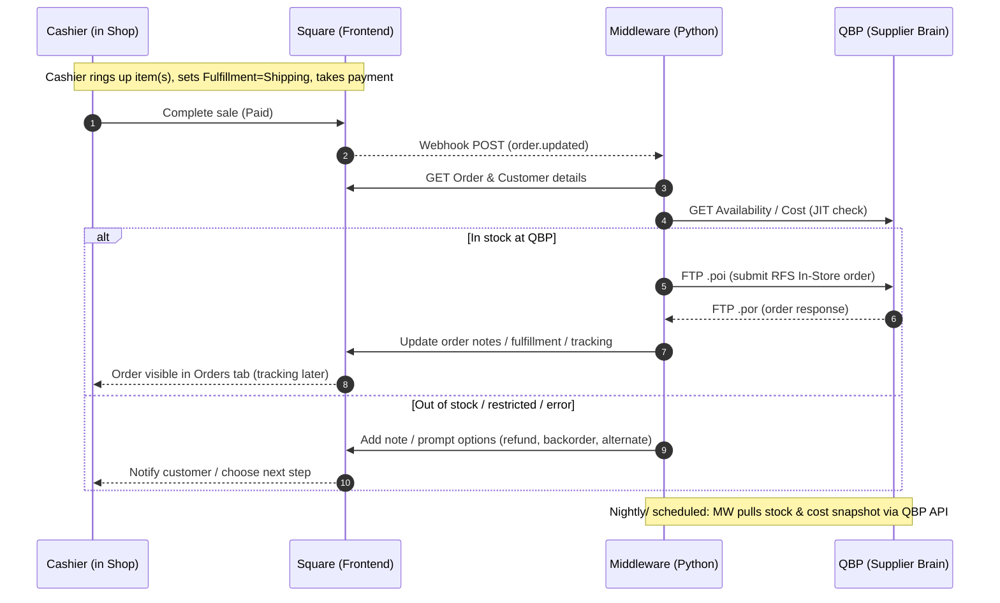

# QBP RFS (In-Store) ↔ Square Integration (Python)

> **Draft README**

---

## Summary
This repository houses a Python service that connects **Square POS** with **QBP’s Retail Fulfillment Service (RFS In-Store)**. The goal is to let shop staff sell items at the counter in Square and have QBP ship directly to the customer, without needing to touch QBP’s B2B portal manually.

- **Square remains the cashier-facing frontend.**
- **Middleware** (this repo) acts as the translator, receiving Square order webhooks, checking QBP availability, building `.poi` purchase orders, and submitting them via FTP.
- **QBP** is the supplier brain: providing catalog, pricing, and stock data via API, and accepting RFS orders via EFTP.

---

## Proposed Architecture

**Roles:**
- **Square (frontend):** Cashiers sell items; Square posts webhooks when orders are paid.
- **Middleware (translator):** Python app that listens to webhooks, maps items to QBP SKUs, checks stock, builds `.poi`, submits to QBP, and updates Square with results.
- **QBP (supplier brain):** Provides catalog/stock via API and accepts RFS orders via `.poi` FTP submissions.

---

## API Details

### Square APIs Used
- **Orders API** – Fetch order details, update fulfillment/notes.
- **Customers API** – Pull customer shipping info.
- **Webhooks** – Subscribe to `order.updated` events; Square will POST JSON payloads to middleware.
- *(Phase 2)* **Inventory API** – Push supplier stock counts into a virtual QBP warehouse inside Square.
- *(Phase 2)* **Catalog API** – Manage item mapping, pricing updates.

### QBP Interfaces Used
- **POS API (outbound)** – GET stock, cost, and catalog data.
- **EFTP (FTP/SFTP)** – Inbound `.poi` files to submit orders; `.por` response files for confirmations/errors.

### Middleware Responsibilities
- Listen for Square webhooks (FastAPI endpoint).
- Map Square variation → QBP SKU.
- Just-in-time check: GET QBP stock before submit.
- Build `.poi` file in QBP flat-file format.
- FTP `.poi` to QBP, poll for `.por`.
- Update Square order with QBP order/cart ID and (later) tracking.
- Cron job to pull QBP stock/cost daily (Phase 1) or every 5–10 minutes (Phase 2).

---

## Next Steps
- Scaffold Python FastAPI app (`/src/app.py`) with webhook endpoint.
- Add QBP snapshot job (`/src/qbp_snapshot.py`).
- Create `.env` template with Square and QBP credentials.
- Set up dev environment with uvicorn + ngrok for webhook testing.

---